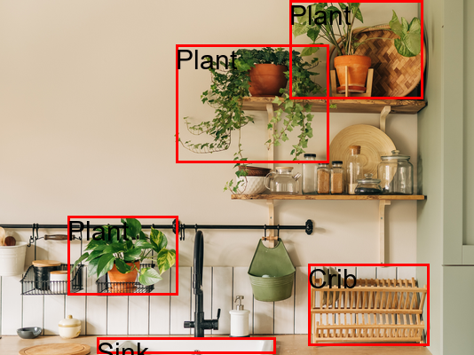

# Semi1-HT1-202010055

API de reconocimiento de objetos en una imagen utilizando Amazon Rekogition

Enviar la imagen en bBase64 en una peticion POST a `/hoja1-202010055`. El body debera ser:

```
{
    "image":string
}
```

Se regresara un JSON con las labels encontradas por Rekognition. Asi mismo se generara una imagen con las labels agregadas en `/images/image_labels.png`

## Input


## Outpu


